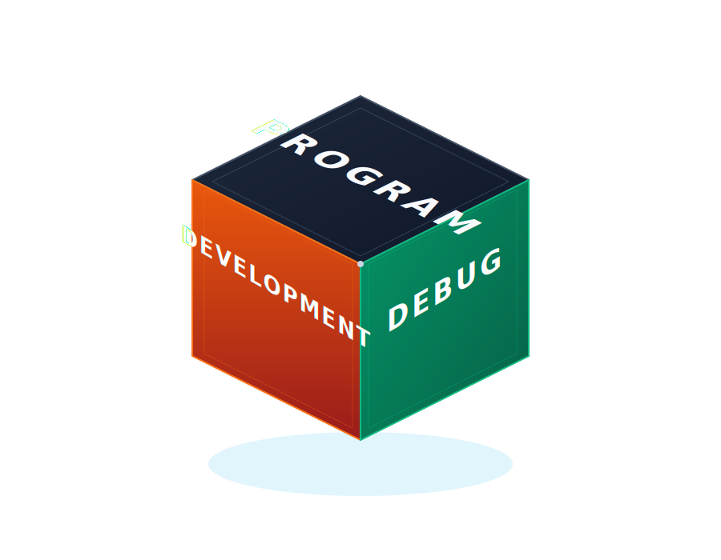

  

<h1 align="center">Hey 👋</h1>

###
<h3> My tech stack <h3>
**Languages**
  

  
  
  
  

**Frontend**

  
  
  

**Databases**

  
  

**Backend**

**Tools**

 
  

### 🤝 Social Media

  
  
  

<!-- Cube image: floats to the right of the skill badges on wide screens -->

  

---

### 📈 GitHub Statistics

  
  

  

---
