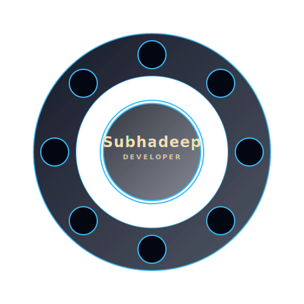

<h1 align="center">Hey 👋 I am Subhadeep Adhikary</h1>

###
<h2> Skills and tools <h2>

  
  
  
  
  
  
  
  
  
  
  
  
  
  
  
  
  
  
  

###

 

  
  
  

###

 

<picture>
  <source media="(prefers-color-scheme: dark)" srcset="https://raw.githubusercontent.com/Subhadeep-Adhikary/Subhadeep-Adhikary/pacman-output/pacman-contribution-graph-dark.svg">
  <source media="(prefers-color-scheme: light)" srcset="https://raw.githubusercontent.com/Subhadeep-Adhikary/Subhadeep-Adhikary/pacman-output/pacman-contribution-graph.svg">
  
</picture>

###

  

###

  

###
